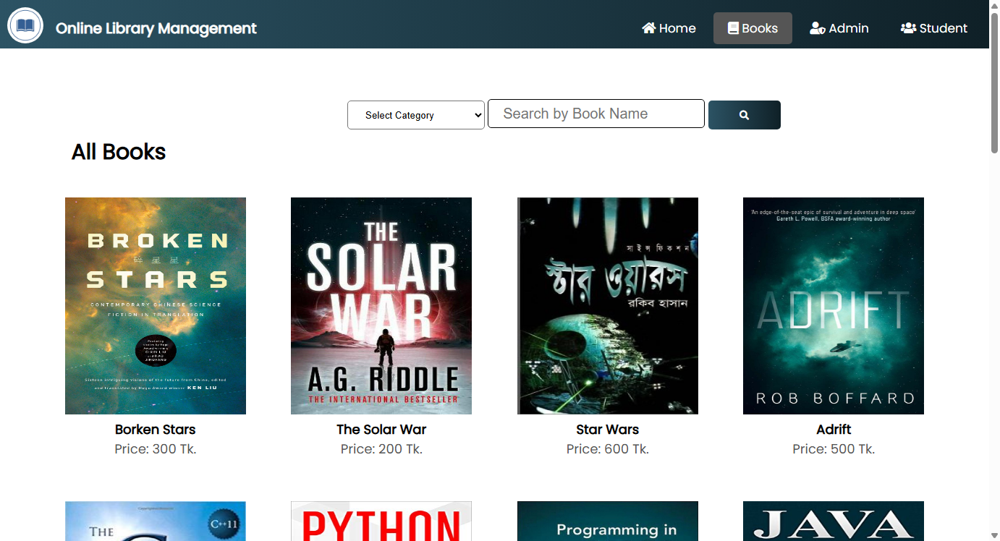
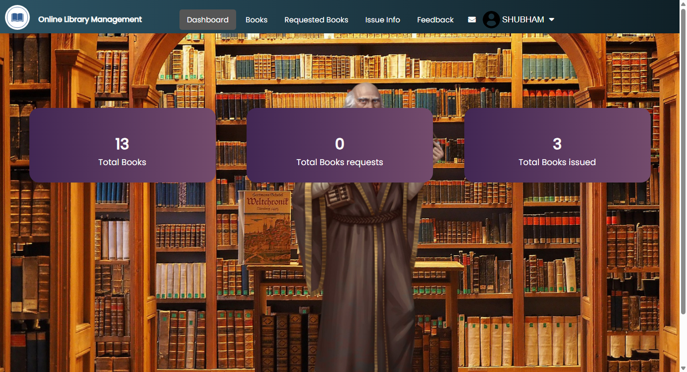
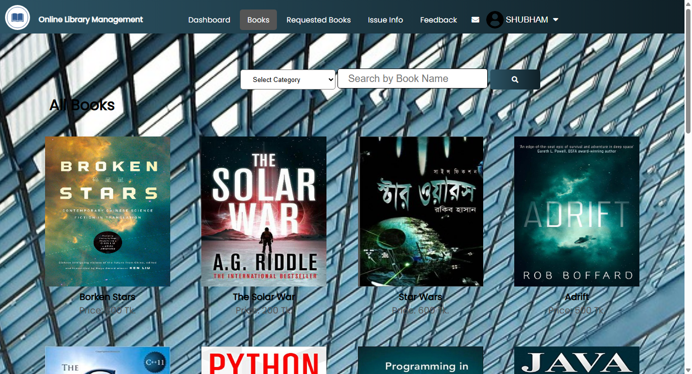
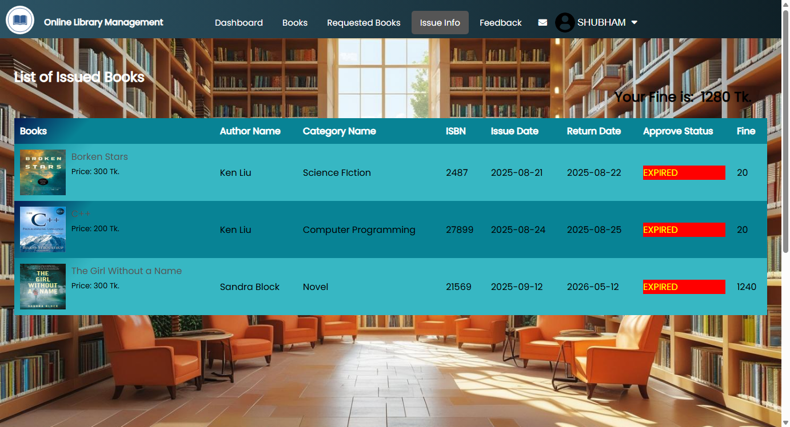
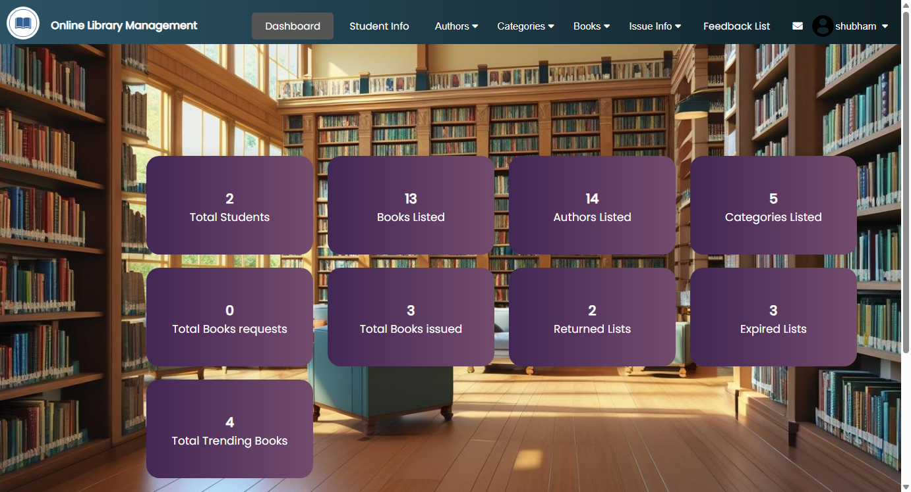
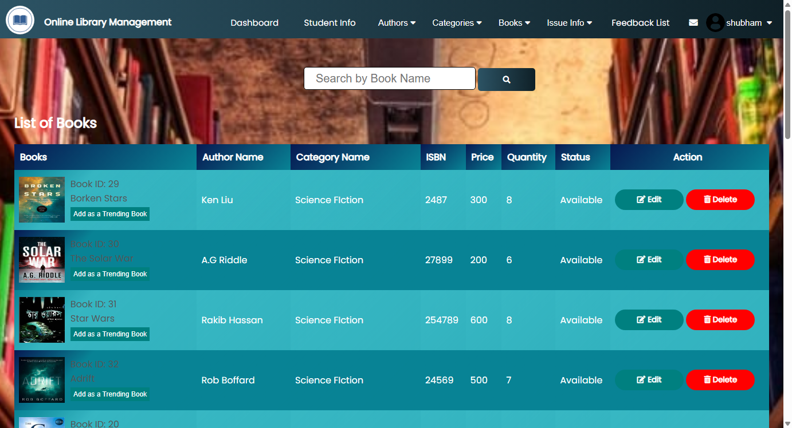
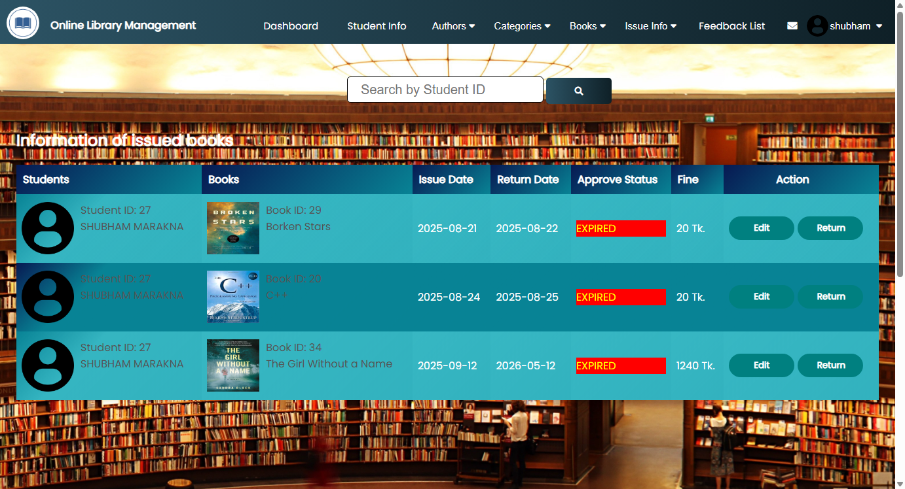
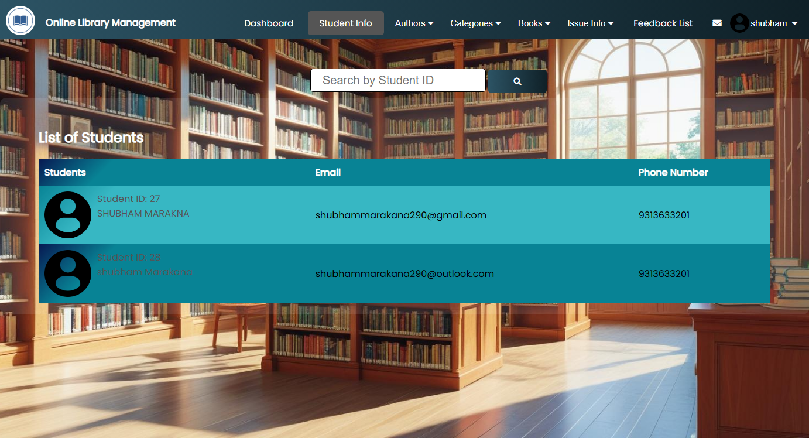
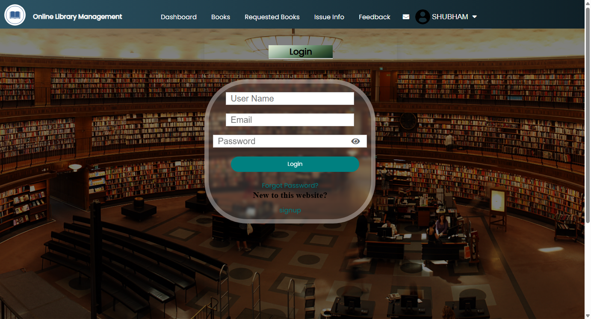

# 📚 Online Library Management System (SMLS / MSMLS)


A comprehensive, full-featured **Online Library Management System** developed in **PHP & MySQL**. It provides automated cataloging, real-time book request/issue tracking, student record management, fine calculation for overdue items, author & category administration, messaging, and interactive feedback.

---

## 📸 Screenshots & UI Showcase

| 🏠 Home Page & Trending Books | 📖 Books Catalog & Category Filter |
| :---: | :---: |
|  |  |

| 🎓 Student Dashboard | 📚 Student Browse & Request Books |
| :---: | :---: |
|  |  |

| 📋 Student Issued Books & Returns | 📊 Admin Dashboard & Key Metrics |
| :---: | :---: |
|  |  |

| 🛠️ Admin Manage Books Inventory | 📑 Admin Issued Books & Approvals |
| :---: | :---: |
|  |  |

| 👥 Student Records & Info | 🔐 Multi-Role Authentication Portal |
| :---: | :---: |
|  |  |

---

## ✨ Key Features

### 👨‍💼 Admin Features
- **Interactive Dashboard**: Real-time KPI counts for total registered students, cataloged books, active authors, categories, issued books, pending return requests, and overdue fines.
- **Book Inventory Management**: Add new books with cover images, ISBN, quantity, price, author, and category assignment. Real-time search, inline edit, and delete options.
- **Issue & Return Tracking**: Approve book issue requests from students, monitor issue/return dates, and calculate overdue penalty fines automatically.
- **Authors & Categories Management**: Full CRUD operations to organize books by multiple authors and genres.
- **Student Information**: View and manage all enrolled students with contact info and borrowing histories.
- **In-App Messaging & Communication**: Direct student-to-admin message inbox with unread notifications.
- **Feedback & Rating System**: Review ratings and testimonials submitted by students.

### 🎓 Student Features
- **Student Portal & Profile**: Personalized dashboard displaying currently borrowed books, request status, profile settings, and password management.
- **Interactive Books Catalog**: Search and browse available library books by title, author, category, or ISBN.
- **One-Click Book Requests**: Request books directly with automated availability checks and queue tracking.
- **Borrowing History & Timer**: View issued books with live return deadlines and expiry status.
- **Feedback Submission**: Submit ratings (1-5 stars) and comments to the administration.

---

## 🛠️ Tech Stack & Requirements

- **Backend**: PHP (8.0+)
- **Database**: MySQL / MariaDB (InnoDB, utf8mb4)
- **Frontend**: HTML5, CSS3, JavaScript (ES6+), FontAwesome 5 icons, Google Fonts (Poppins, Kaushan Script)
- **Server**: Apache (XAMPP, WAMP, LAMP)

---

## 🚀 Installation & Setup Guide

### 1. Prerequisites
Ensure you have **XAMPP** (or LAMP/WAMP) installed with Apache and MySQL enabled.

### 2. Clone the Repository
```bash
git clone https://github.com/shubhammarakana/Library-Management-System-.git
```
*Or place the project directory into your web server root (`c:/xampp/htdocs/`)*.

### 3. Database Setup
1. Open **phpMyAdmin** (`http://localhost/phpmyadmin/`).
2. Create a new database named **`lms2`**.
3. Click **Import** and select the [`127_0_0_1.sql`](127_0_0_1.sql) file located in the root directory.
4. Click **Go** to import tables and default seed data.

### 4. Configure Database Connection
If your MySQL credentials differ from the default (`localhost`, `root`, blank password), update [`connection.php`](connection.php):
```php
<?php
$db = mysqli_connect("localhost", "root", "", "lms2");

if(!$db) {
    die("Connection failed: " . mysqli_connect_error());
}
?>
```

### 5. Run the Application
Open your browser and navigate to:
```
http://localhost/MSMLS/MSMLS/SMLS/index.php
```

---

## 🔑 Default Credentials

| Role | Username | Password |
| :--- | :--- | :--- |
| **Admin** | `shubham` | `1712` |
| **Student** | `SHUBHAM` | `123` |

---

## 📂 Project Structure

```
SMLS/
├── css/                        # Stylesheets and font assets
├── images/                     # Book covers, avatars, and UI assets
├── screenshots/                # Showcase screenshots for documentation
├── 127_0_0_1.sql               # Complete MySQL database export
├── connection.php              # Database connection handler
├── index.php                   # Visitor landing page with trending books
├── index_books.php             # Public book catalog
├── student.php                 # Student login portal
├── student_reg.php             # Student registration portal
├── student_dashboard.php       # Student portal dashboard
├── student_books.php           # Student book catalog & request
├── student_issue_info.php      # Student issued books status
├── admin.php                   # Admin login portal
├── admin_dashboard.php         # Admin control center
├── manage_books.php            # Admin book inventory
├── manage_issued_books.php     # Admin issue/return tracking
├── manage_authors.php          # Admin author manager
├── manage_categories.php       # Admin category manager
├── student_info.php            # Admin student records
├── message.php                 # Student messaging inbox
├── admin_message.php           # Admin messaging inbox
├── feedback.php                # Student feedback form
├── feedback_info.php           # Admin feedback reviews
└── README.md                   # Project documentation
```

---

## 📄 License
This project is open-source and available under the [MIT License](LICENSE).
